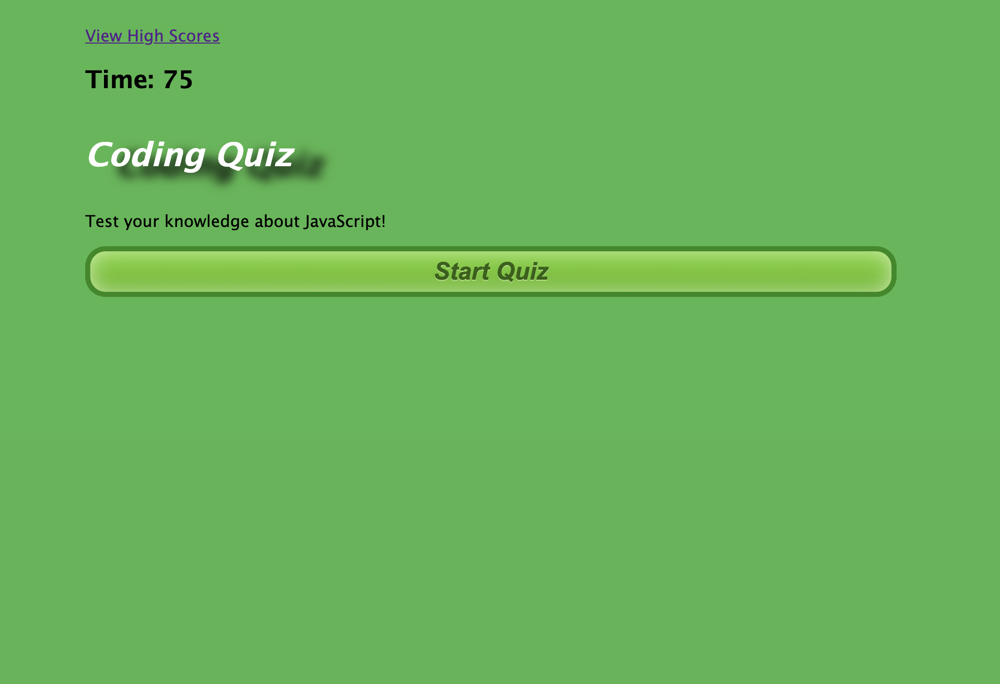
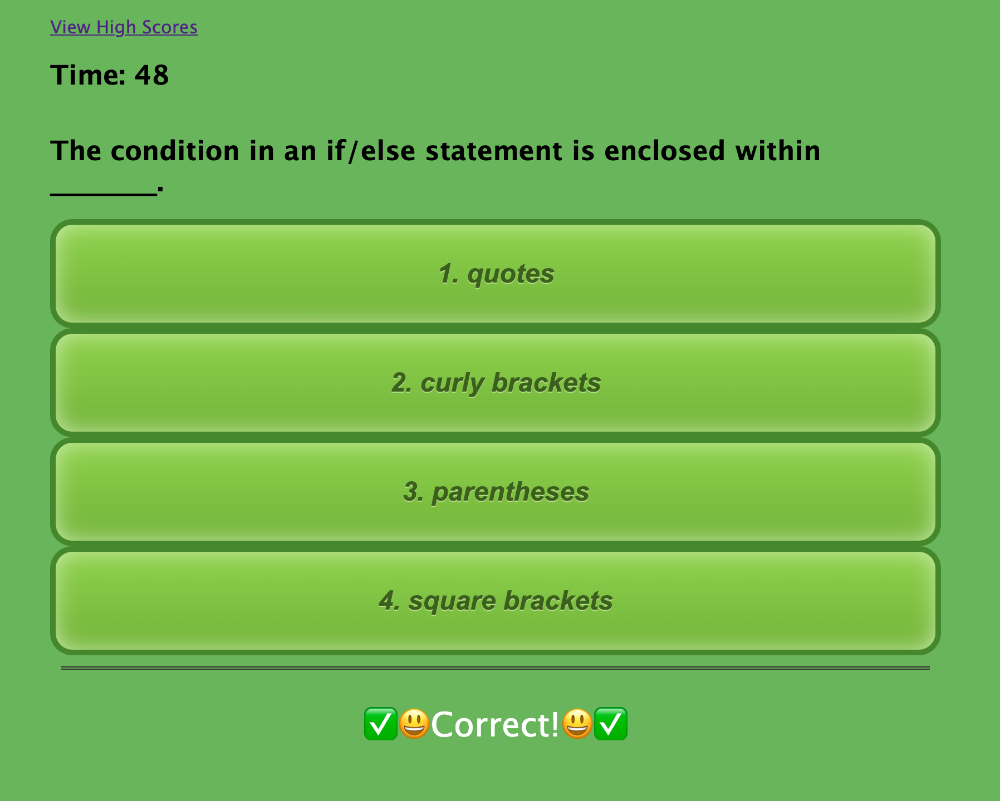
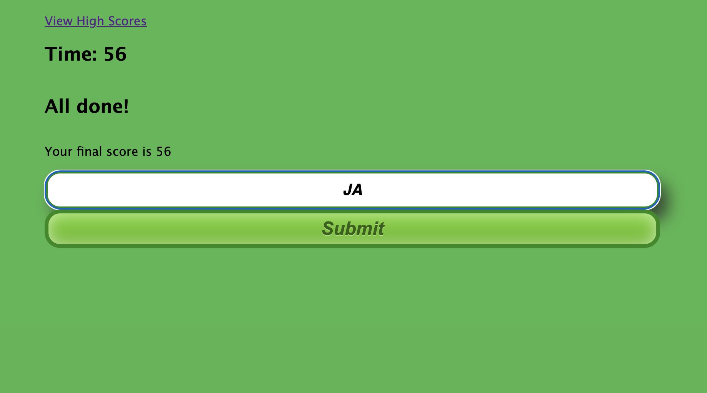
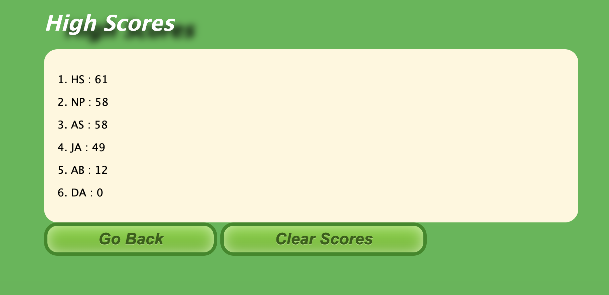

# Homework 4: Code Quiz #
Code Quiz - Jae Ahn

This is a browser application that features a timed quiz with 10 multiple-choice questions on JavaScript fundamentals that allows the user to gauge their coding knowledge.

At the start of the application, the user is presented with a start button.  Once the start button is clicked, the timer displayed on the screen will begin counting down every second starting from 75, and the user will be presented with the first multiple choice question.  When the user clicks their answer for the question, they will be receive feedback (correct or incorrect) and be presented with another question.  If the user answers a question incorrectly, 10 seconds are subtracted from the timer.  The quiz ends on 2 conditions: 
* The user answers all 10 questions within the time limit, or
* the timer hits 0.

Once the quiz is over, the user is presented with a message informing them of their score (amount of time left at completion of the quiz) and they are able to enter and submit their initials in a form.  After the user submits this form, the user's initials and score are saved to local storage, and the user is taken to the *High Scores* page which displays a ranked list of the initials and scores of previous quiz takers.  At this page, the user is presented with two buttons.  The *Go Back* button will take the user back to the original *Coding Quiz* page, where they can start the quiz again.  The *Clear Scores* button will clear the high scores list and take the user back to the original *Coding Quiz* page.  At any point while at the *Coding Quiz* page, the user can click the *View Highscores* link at the top of the screen to go to the *High Scores* page.

Link to Deployed Application
---------------
[Coding Quiz](https://ahnjaeyung.github.io/Homework_4_Code_Quiz/)